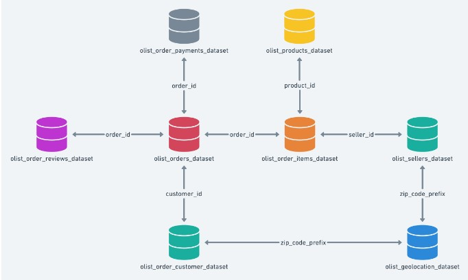
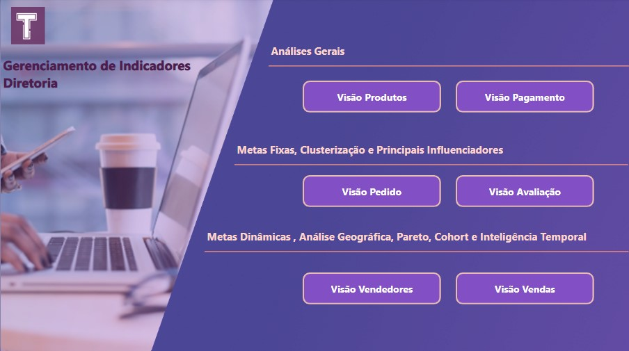
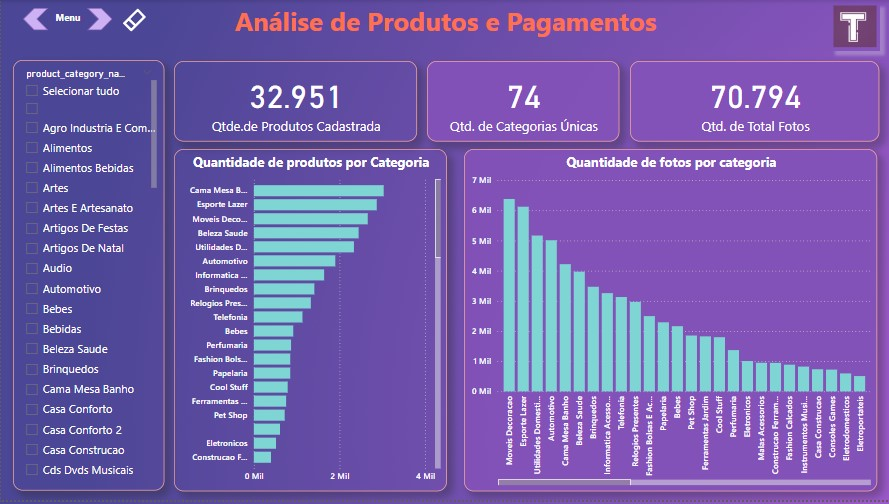
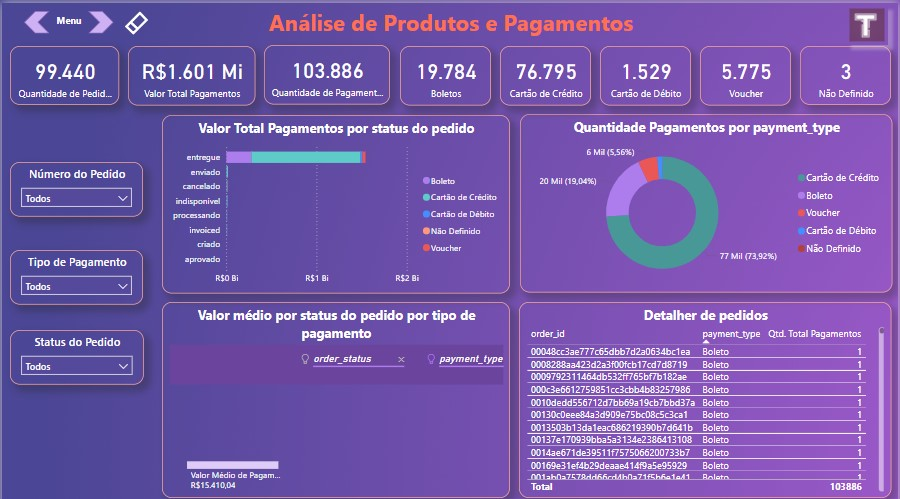
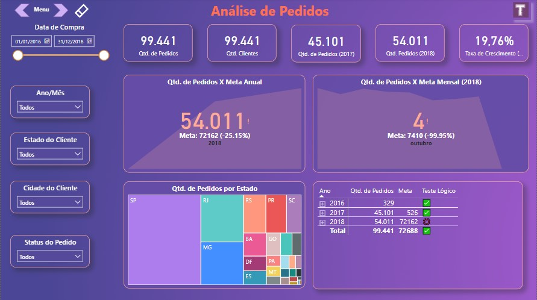
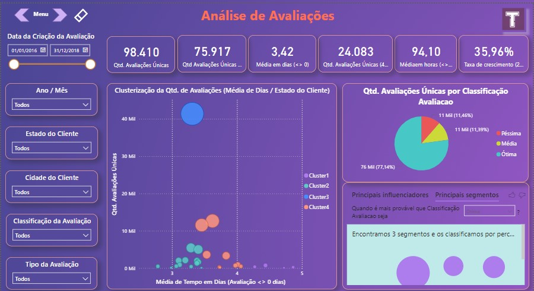
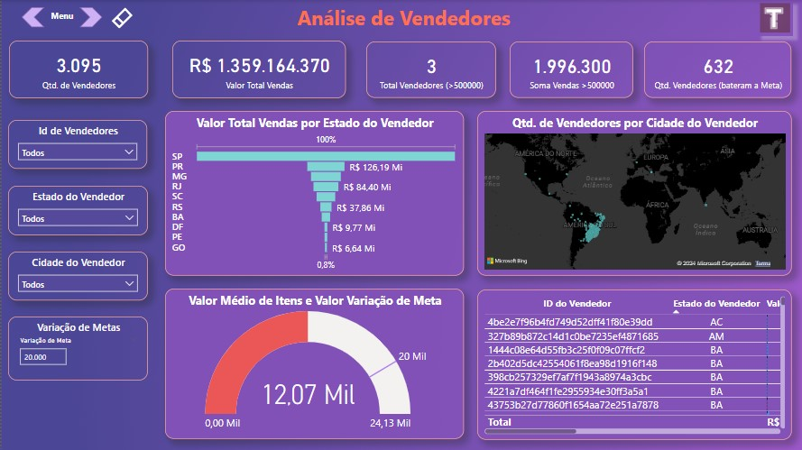
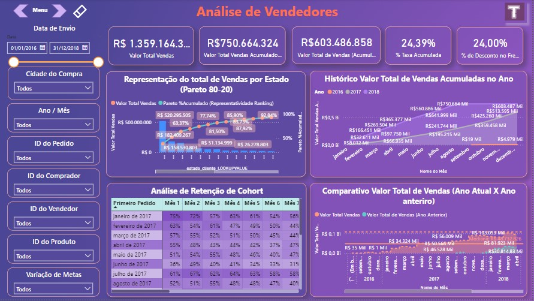

# Marketplace_Olist_Dashboards
## 1. Problema de Negócio
Este projeto foi desenvolvido utilizando dados públicos do projeto Brazilian E-Commerce Public Dataset by Olist disponíveis no Kaggle em: https://www.kaggle.com/datasets/olistbr/brazilian-ecommerce

A descrição do negócio, fornecida no site Kaggle é:

#### 1.1 Brazilian E-Commerce Public Dataset by Olist
Bem-vindo! Este é um conjunto de dados públicos de comércio eletrônico brasileiro de pedidos feitos na Olist Store. O conjunto de dados contém informações de 100 mil pedidos de 2016 a 2018 feitos em vários marketplaces no Brasil. Seus recursos permitem visualizar um pedido em múltiplas dimensões: desde status do pedido, preço, desempenho de pagamento e frete até localização do cliente, atributos do produto e finalmente avaliações escritas pelos clientes. Também lançamos um conjunto de dados de geolocalização que relaciona os CEPs brasileiros às coordenadas lat/lng.

Estes são dados comerciais reais, foram anonimizados e as referências às empresas e parceiros no texto da revisão foram substituídas pelos nomes das grandes casas de Game of Thrones.

#### 1.1.1 Contexto
Este conjunto de dados foi generosamente cedido pela Olist, a maior loja de departamentos dos mercados brasileiros. Olist conecta pequenas empresas de todo o Brasil a canais sem complicações e com um único contrato. Esses comerciantes podem vender seus produtos através da Olist Store e enviá-los diretamente aos clientes usando os parceiros logísticos da Olist. Veja mais em nosso site: www.olist.com

Depois que um cliente compra o produto na Olist Store, um vendedor é notificado para atender ao pedido. Assim que o cliente recebe o produto, ou vence a data estimada de entrega, o cliente recebe por e-mail uma pesquisa de satisfação onde pode dar uma nota sobre a experiência de compra e anotar alguns comentários.

#### 1.1.2 Data Schema
<!--  -->

### 1.2 O problema de negócio
Diante do contexto fornecido no site Kaggle e o Data Schema, foi proposta a construção de um relatório geral de toda a base de dados que pudesse não só ser consultado pelos executivos do banco, como também ser usado por várias áreas da empresa para análise de estratégias, geração de insights e identificação de gaps. Os requisitos do projeto e análises solicitadas foram:

- Um menu de navegação
- Análises solicitadas: Visão Produtos; Visão Pagamentos; Visão Pedidos; Visão Avaliação; Visão Vendedores; Visão Vendas.

## 2. Estratégia da Solução
- Construir um relatório com as princípais visões de negócio (segmentações das análises) solicitadas: Visão Produtos; Visão Pagamentos; Visão Pedidos; Visão Avaliação; Visão Vendedores; Visão Vendas.
- Como informado no problema de negócio, o modelo de negócio é markeplace.
- Foi decidido criar uma relatório com diferentes dashboards no Power BI.
- Para as visualizações, análise e métricas utilziando inteligência temporal foi craida uma tabela calendário relacionada a todas as tabelas com datas

#### 2.1 Menu:
- Um menu interativo para navegação de páginas

#### 2.2 Visão Produtos:
- Filtros de Categoria
- Quantidade de Produtos Cadastrados
- Quantidade de Categorias
- Quantidade total de Fotos
- Quantidade de Produtos por Categorias
- Quantidade de fotos por categorias

#### 2.3 Visão Pagamentos:
- Filtros de Pedidos, Status e Tipos de Pagamentos
- Quantidade de Pedidos
- Valor total de pagementos
- Quantidade de pegamentos (Boleto, Cartão de Crédito e Débito, Voucher e Não Definidos)
- Calor total de pagamentos por Status do Pedido
- Quantidade de Pagamentos por Tipo de Pagamento
- Valor médio por status de pedido e tipo de pagamento
- Detalhes do pedido

#### 2.4 Visão Pedidos:
- Filtros de Data de Compra, Ano/Mês, Estado e Cidade do cliente e Status do Pedido
- Quantidade de pedidos (Total, 2017 e 2018)
- Taxa de Crescimento de pedidos
- KPI Quantidade de Pedidos X Meta Anual
- KPI Quantidade de Pedidos X Meta Mensal (2018)
- Quantidade de Pedidos por Estado
- Detalhe de Quantidade de pedidos por meta mês a mês

#### 2.5 Visão Avaliação:
- Filtro de Data de avaliação, Ano/Mês, Estado e cidade do cliente, Classificação da Avaliação, Tipo de Avaliação.
- Quantidade de Avaliações
- Quantidade de Avaliações entre 4 e 5
- Média de avaliações por dia diferente de 0
- Quantidade de avaliações de SP e RJ entre 4 e 5
- Taxa de crescimento Avaliações de SP e RJ entre 4 e 5 de 2017 a 2018
- Clusterização da Quantidade de Avaliações (Média de Dias / Estado do Cliente)
- Quantidade Avaliações Únicas por Classificação de Avaliação
- Principais influenciadores de Classificação de Avaliação por Estado do Cliente

#### 2.6 Visão Vendedores:
- Filtros de ID de Vendedores, Estado e Cidade do Vendedor, Variação da meta no ano
- Valor total de Vendas
- Total de Vendedores superior a 500 mil
- Valor total de vendas superior a 500 mil
- Quantidade de Vendedores que bateral a meta
- Funil de Valor total de Vendas por Estado
- Mapa da quantidade de Vendedores por Cidade do Vendedor
- Valor Média de Itens e Valor de Variação da meta
- Detalhe dos Vendedores

#### 2.7 Visão Vendas 
- Filtro de Data de Envio, Cidade da Compra, ID's de Vendedores, Produtos, Clientes e Pedido, Variação da Meta e Ano/Mês
- Valor Total de Vendas
- Valor Total Vendido Acumulado YTD e Ano anterior
- Percentual de taxa acumulada
- Percentual de Desconto no Frete
- **Diagrama de Pareto 80-20** de total Vendido por Estado
- **Histórico Total de Vendas Acumuladas no Ano**
- **Análise de Cohort de Retenção**
- Comparativo Valor Total de Vendas (Ano Atual X Ano Anterior)

## 3. Tecnologias usadas
- **Power BI:** Extração de dados, limpeza de dados, construção de métricas, criação das visualizações e análises dos dados.

## 4. Como executar o projeto
- Para executar o projeto localmente faça o dowlonad do arquivo "Projeto_Olist_VF.pbix" e execute o arquivo para visualizar a base de dados, tabelas, métricas e os dashbords criados.

## 5. Top 3 Insights de dados
- SP e RJ são os estados que representam 50% do acumulado do valor total de vendas da empresa. Estes estados também tiveram um aumento de 36% de avaliações 4 ou 5 de 2017 para 2018;

- No valor acumulado de todos os mêses a emrpesa cresceu ao comparar os anos de 2018 com 2017
- No ano de 2018 a quantidade de pedidos está inferior a meta em 25%, tendo uma sequência de meses de julho a setembro do ano em que a meta não foi atingida;
    - Sugestão: Realizar uma **análise diganóstica** para entender o porque da diminuição da quantidade de pedidos nestes meses

### 5.1 Outros Insights
- Cerca de 77.14% dos produtos tiveram uma avaliação "Ótima";
- O Cartão de Crédito é o método de pagamento mais utilizado pelos clientes da empresa.
- O Cohort de julho de 2017 foi o que teve maior retenção dos perídos superiores a 1 ano, um total de 50%, enquanto os outros Cohorts atingiram marcas inferiores de 18%, 34%, 25%, por exemplo.
-Em Agosto de 2018 a empresa atingiu o maior valor total de vendas no mês, totalizando 107,215 mil.

## 6. Próximos Passos
1. Automatização do dashboard após novo recebimento de dados;
2. Criar novos filtros e visualizações após novo feedback;
2. Realizar uma análise diagnóstica para estudo dos insights sugeridos no item 5 e outras solicitações da equipe de RH.